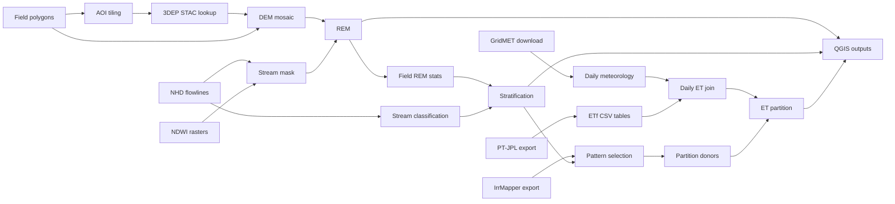

# Overview

`handily` is organized as a staged pipeline with explicit file boundaries. Most stages either consume
local geospatial artifacts or produce them.

## Pipeline

## Stages

### 1. Data Access and Tiling

Purpose: define a workable AOI and make 3DEP DEM tiles locally discoverable.

Inputs:
- statewide or regional field polygons
- TNM 3DEP project index

Outputs:
- AOI tile shapefile
- local STAC catalog

Main modules:
- `handily.aoi_split`
- `handily.stac_3dep`

### 2. Terrain and REM Generation

Purpose: assemble DEM tiles, derive a stream mask, compute REM, and summarize REM over fields.

Inputs:
- field polygons
- local NHD flowlines
- local NDWI rasters
- local 3DEP STAC catalog
- AOI bounds

Outputs:
- `rem_bounds.tif`
- `streams_bounds.tif`
- `fields_bounds.fgb`
- `flowlines_bounds.fgb`

Main modules:
- `handily.pipeline`
- `handily.dem`
- `handily.compute`
- `handily.io`

### 3. Stratification and Pattern Selection

Purpose: attach stream class and REM context to each field, then mark donor candidates.

Inputs:
- REM raster
- field polygons with REM stats
- clipped flowlines
- optional IrrMapper irrigation-frequency table

Outputs:
- `fields_stratified.fgb`
- `fields_pattern.fgb`

Main modules:
- `handily.nhd`
- `handily.stratify`
- `handily.pattern`
- `handily.et.irrmapper`

### 4. Climate and ET Acquisition

Purpose: create daily meteorology by field and export sparse ETf observations by Landsat overpass.

Inputs:
- field polygons
- GridMET centroids
- Earth Engine/OpenET credentials
- bucket and local mirror configuration

Outputs:
- field-level GridMET parquet
- centroid-level GridMET parquet cache
- PT-JPL CSV tables in GCS, then local mirror

Main modules:
- `handily.et.gridmet`
- `handily.et.image_export`
- `handily.bucket`

### 5. ET Join and Partition

Purpose: interpolate sparse ETf to daily cadence and partition AET using donor fields within strata.

Inputs:
- field-level GridMET parquet
- PT-JPL CSV tables
- stratified and patterned fields

Outputs:
- joined daily parquet
- monthly partition parquet

Main modules:
- `handily.et.join`
- `handily.et.partition`

### 6. Delivery Interfaces

Purpose: surface artifacts to GIS users without re-running the workflow.

Inputs:
- output directory
- `.qgs` project or generated `.qlr`

Outputs:
- updated QGIS project
- `handily.qlr`

Main modules:
- `handily.qgis`

## Reference Surface

- CLI-first for STAC, AOI, REM, GridMET, PT-JPL export/join, partition, sync, and QGIS.
- Example-script-first for stratification, IrrMapper export, and pattern selection.
- Notebook-first for visualization and worked Beaverhead interpretation.
